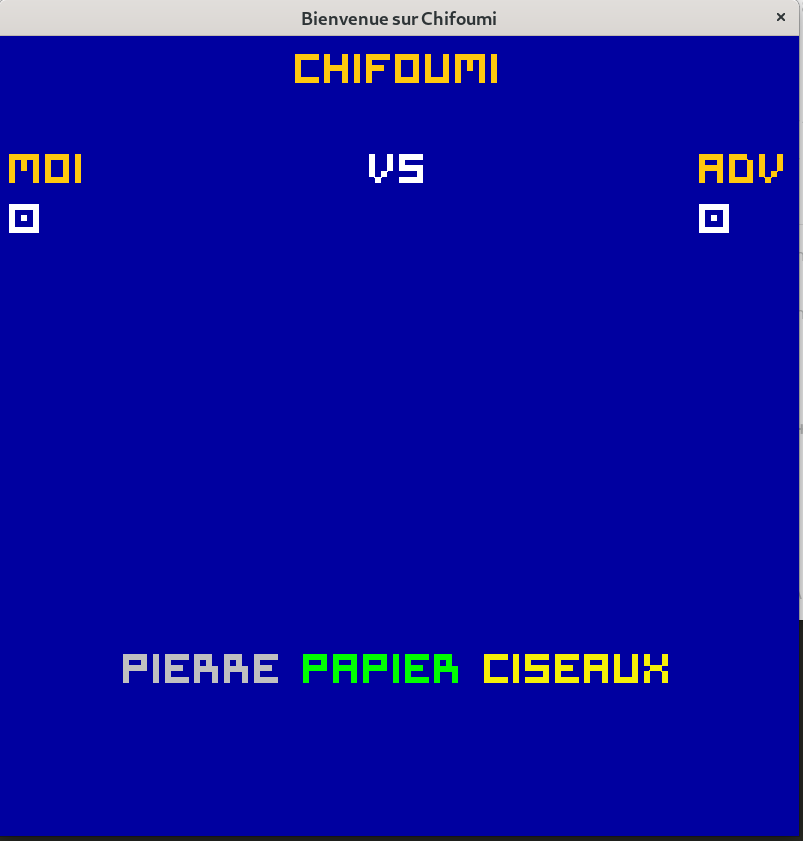

# CHIFOUMI 

## Réalisé par KAMGA DJEMGOU Hisdaele Kavel alias Kadhisk

## Création du jeu Pierre-Papier-Ciseau en C avec Interface graphique avec SDL2

Nous avons deux repertoires:

1. **ChifoumiServeur**: Il contient l'implémentation du serveur:

> - Pour compiler: **gcc  main.c  -o  serveur**
> - Pour lancer le server: **./serveur**

2. **ChifoumiClient**: Il contient l'implémentation du client. On y trouve la réalisation de l'interface pour les joueurs et la connexion au serveur. Il faut modifier l'adresse IP du serveur dans le fichier **ConnexionTCP.h** en modifiant le macro **IP_SERVEUR** avant de compiler. On s'assure aussi d'avoir installer les librairies de SDL2.

> - Pour compiler: **gcc -lSDL2_ttf  \*.c  -o  prog  $(sdl2-config --cflags --libs)**
> - Pour lancer le jeu: **./prog**
> - Avant le lancer le client, il faut s'assurer d'avoir bien lançé le serveur.

Voici quelques captures d'écrans des interfaces graphiques réalisées:

